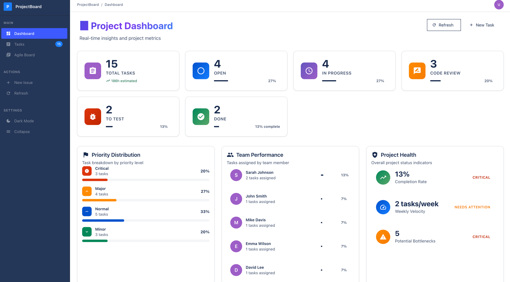
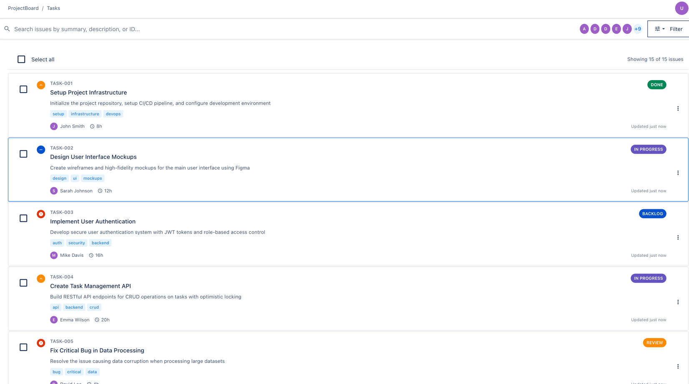
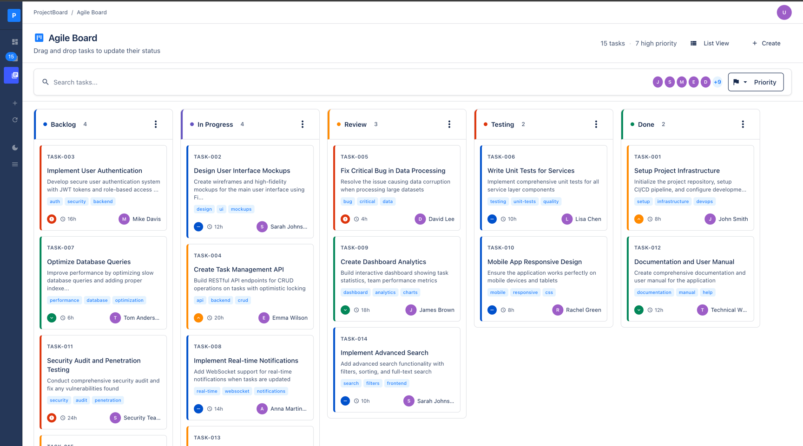

# ProjectBoard

A modern task management application built with Angular 20 and Spring Boot. Features a complete kanban workflow with drag-and-drop, real-time updates, and conflict resolution.

## Features

### Core Functionality
- **Task Management**: Create, edit, delete, and organize tasks
- **Sprint Board**: Drag-and-drop kanban interface with status columns
- **Dashboard**: Project overview with statistics and quick actions
- **Conflict Resolution**: Optimistic locking prevents data corruption
- **Real-time Updates**: Live status changes and progress tracking

### Frontend Pages
- **Dashboard** (`/dashboard`) - Project overview with task statistics
- **Task List** (`/tasks`) - Comprehensive task management with filtering
- **Task Form** (`/tasks/new`, `/tasks/:id/edit`) - Create and edit tasks
- **Sprint Board** (`/board`) - Kanban interface with drag-and-drop

## Technology Stack

### Backend
- **Spring Boot 3.5.3** with Java 21
- **H2 Database** with JPA for persistence
- **REST API** with comprehensive CRUD operations
- **Optimistic Locking** using @Version for conflict handling
- **Exception Handling** with global error management

### Frontend
- **Angular 20** with standalone components
- **Angular Material** for UI components
- **Signals** for reactive state management
- **CDK Drag & Drop** for kanban functionality
- **Reactive Forms** with validation

## Development Workflow

### Git Strategy
- `main` branch for production-ready code
- Feature branches: `feature/<issue-number>`
- Pull request workflow for all changes
- Issues linked to project board for tracking

### Sprint Methodology
- **Project Board**: Classic GitHub project with To Do, In Progress, Done columns
- **Issue Tracking**: Each feature implemented as separate GitHub issue
- **Feature Development**: Branch per issue with descriptive commits
- **Integration**: Regular merging to main with proper testing

### Code Organization

#### Backend Structure
```
backend/src/main/java/com/projectboard/
├── entity/          # JPA entities (Task)
├── repository/      # Spring Data repositories  
├── service/         # Business logic layer
├── controller/      # REST API endpoints
├── dto/            # Data transfer objects
└── exception/      # Error handling
```

#### Frontend Structure
```
frontend/src/app/
├── components/     # Reusable UI components
├── pages/         # Route-specific page components
├── services/      # API integration services
├── models/        # TypeScript interfaces
└── shared/        # Common utilities
```

## Getting Started

### Prerequisites
- Node.js 22+
- Java 21+
- Git

### Installation
```bash
# Clone repository
git clone https://github.com/tusharkh12/ProjectBoard.git
cd ProjectBoard

# Backend setup
cd backend
./gradlew build

# Frontend setup  
cd ../frontend
npm install
```

### Running the Application
```bash
# Start backend (http://localhost:8080)
cd backend
./gradlew bootRun

# Start frontend (http://localhost:4200)
cd frontend  
npm start
```

### Development Commands
```bash
# Backend
./gradlew test          # Run tests
./gradlew build         # Build application

# Frontend
npm test               # Unit tests
npm run build          # Production build
npm run lint           # Code linting
```

## API Endpoints

### Tasks
- `GET /api/tasks` - List all tasks with filtering
- `POST /api/tasks` - Create new task
- `GET /api/tasks/{id}` - Get task by ID
- `PUT /api/tasks/{id}` - Update existing task
- `DELETE /api/tasks/{id}` - Delete task

### Statistics
- `GET /api/tasks/statistics` - Task completion metrics
- `GET /api/tasks/search` - Search tasks by criteria

## Project Management

### Issue Lifecycle
1. **Planning**: Issue created in GitHub with clear requirements
2. **Development**: Feature branch created, work begins
3. **Review**: Pull request opened with description
4. **Integration**: Code merged to main after review
5. **Deployment**: Feature available in main branch

### Definition of Done
- [ ] Feature implemented according to requirements
- [ ] Code reviewed and approved
- [ ] Tests passing (unit and integration)
- [ ] Documentation updated
- [ ] Merged to main branch

---

### Frontend Pages
- **Dashboard** (`/dashboard`) - Project overview with task statistics
  

- **Task List** (`/tasks`) - Comprehensive task management with filtering
  

- **Sprint Board** (`/board`) - Kanban interface with drag-and-drop
  

Built with modern web technologies for efficient task management and team collaboration.